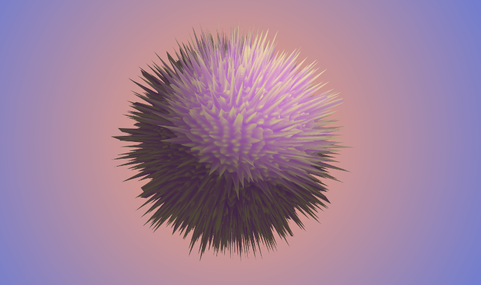

### Reaction Diffusion studies

This repository contains 4 apps that I've done while learning the reaction diffusion simulation developed by Gray-Scott.

The app `reactionDiffusionNaive` contains an openFramework sketch that implements the simulation as explained in the [Shiffman's tutorial](https://www.youtube.com/watch?v=BV9ny785UNc). This implementation is slow (around 20FPS) but it is easy to understand.

The app `reactionDiffusionFBO` does the same but using FBOs and the ping-pong technique to improve performance. It is still a work in progress.

The app reactionDiffusion3D is the same as before, but with the texture applied to a sphere and vertex displacement

All the application comes with a GUI to try out differents presets, press `g` to use the GUI.

#### Resources

http://www.karlsims.com/rd.html

http://blog.hvidtfeldts.net/index.php/2012/08/reaction-diffusion-systems/

http://web.archive.org/web/19981206145216/http://www.ccsf.caltech.edu/ismap/image.html

http://mrob.com/sci/talks/20101209.html

http://groups.csail.mit.edu/mac/projects/amorphous/GrayScott/

